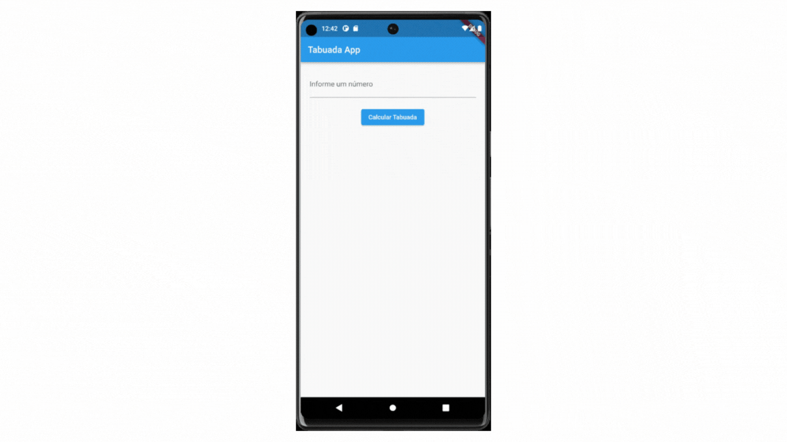

# Gerador de tabuada

Este é um aplicativo simples para gerar tabuadas utilizando o framework Flutter e a linguagem Dart.

## Funcionalidades

- Gera tabuadas para os números de 1 a 20.
- Permite ao usuário escolher qual número deseja gerar a tabuada.
- Interface amigável e fácil de usar.

## Demonstração



## Pré-requisitos

Antes de começar, certifique-se de ter o Flutter instalado e configurado no seu ambiente de desenvolvimento.

## Instale as dependências
flutter pub get

### Como usar
Clone o repositório:
```bash
git clone https://github.com/Sergioadjr/tabuada-flutter.git
```
Navegue até o diretório do projeto:
```bash
cd Desktop
```
Avance para a pasta tabuada_flutter 
```bash
cd tabuada_flutter
```
Antes de inicializar, no terminal da IDE digite:
```bash
flutter clean
flutter build apk
```
Por fim, para iniciar o projeto:

### Iniciar o app:
```bash
flutter run
```